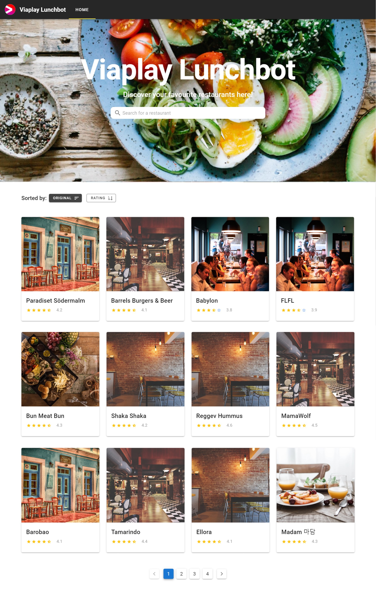
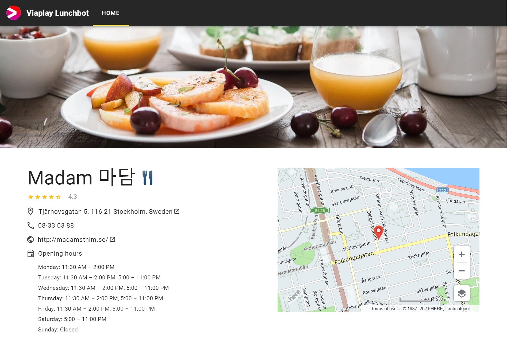

# Viaplay Lunchbot

## Run mongodb-backend
1. Install NodeJS: https://nodejs.org/en/download/.
2. Install MongoDB: https://docs.mongodb.com/manual/administration/install-community/.
3. Navigate into the `/mongodb-backend` folder through a terminal.
4. Import the Restaurants database from the `provision/db.json` file:
   ```
   mongoimport --host <your_mongodb_host> --db viaplay --collection restaurants --type json --file ./provision/db.json --jsonArray
   ```
   E.g. My mongodb host is [127.0.0.1:27017](127.0.0.1:27017). Please see more details on https://docs.mongodb.com/guides/server/import/.
5. Install node dependencies: `npm install`.
6. Run the db server: `npm start`.

## Run vue-frontend
1. Navigate into the `/vue-frontend` folder through a terminal.
2. Install node dependencies: `npm install`.
3. Compiles and hot-reloads for development: `npm run serve`.
4. Open your browser and go to [http://localhost:8080](http://localhost:8080).

## Feature List
- **Implement material design style using [Vuetify](https://vuetifyjs.com/en/).**
- **Homepage**
    - Displays the list of the restaurants getting from `localhost:3000/api/list`.
    - A search bar which allows users to search for a specific restaurant(s) whose name contains the search content.
    - A sort function which allows users to sort restaurants with rating ascending or descending.
    - Pagination of the list of restaurants to prevent from displaying too many data on a single page.
- **Detailed page of each restaurant**
    - Displays more information about the selected restaurant from `localhost:3000/api/restaurant/{id}`.
    - A [Here Map](https://developer.here.com/develop/javascript-api) displays the location of the restaurant marked by a red location icon.

##### The screenshot of the homepage:


##### The screenshot of the detailed page:


## Possible Improvements
- Add autocomplete in the search bar.
- Add more sorting options. E.g., sorting restaurants by their names from A-Z.
- Beautify the 'opening hours' section in the detailed page.